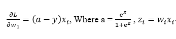

# Softmax-Classifier
Build a Softmax classifier for fashion MNIST dataset

## Requirement 
* Python3 
* h5py==2.8.0
* matplotlib==2.1.1
* numpy==1.15.1

You can use `pip install` to install the packages you need.

## Description
### Loss Function


### Gradient-based Optimization

### Regularization

### Momentum


For more detailed description, see [my blog](http://sallykang.com/blog/2018/10/09/softmax-classifier-implementation)
## Usage 
To run this program
```
python train.py
```
It will print the training loss every 50 epochs. After the program finishes, a train loss curve and an accuracy curve will be plot automatically. Check output folder, the predicted_labels.h5 containing the labels of last 3000 test samples will be created after the program is finished.

To run this model with different parameters to repeat experiment results above, change the corresponding parameters in `train.py` from following functions
```
model = LogisticRegression(num_iters = 300,
                alpha=0.8,
                with_reg = True,
                with_monentum = True)
results = model.train(train_data.T, train_label.T, Y, test_data_2000.T,test_label.T[0], print_loss=True)
```

To print out confusion matrix, uncomment these two lines in  `train.py`
```
# cfn = cnf_matrix(label_prediction_test,test_label)
# print(cfn)
```
